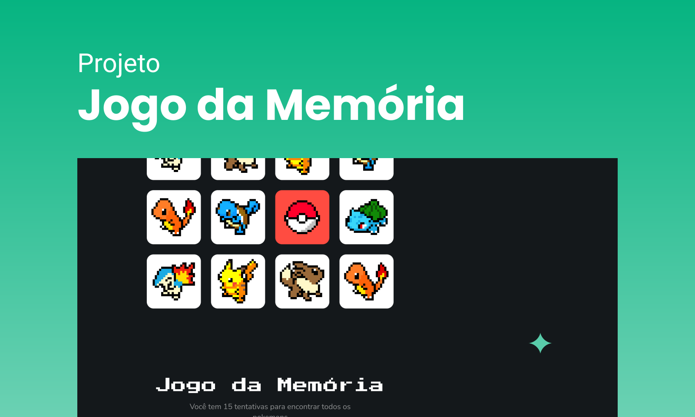

<h1 align="center"> Memory Game </h1>

    

  <a href="#-tecnologias">Tecnologias</a>&nbsp;&nbsp;&nbsp;|&nbsp;&nbsp;&nbsp;
  <a href="#-projeto">Projeto</a>&nbsp;&nbsp;&nbsp;|&nbsp;&nbsp;&nbsp;
  <a href="#-layout">Layout</a>

 

  

## 🚀 Tecnologias

Esse projeto foi desenvolvido com as seguintes tecnologias:

- HTML e CSS
- JavaScript
- Git e Github
- Figma

## 💻 Projeto

Memory Game como o proprio nome diz, se trata de um jogo da memoria cujo o objetivo é o usuario encontrar os pares de cartas contendo os mesmos Pokemons. O jogo monitora os erros do usuario e caso o player não encontre todas as combinações em até 15 jogadas o jogo é finalizado e o usuario recebe uma notificação de Game Over. Mas se ele conseguir vencer o jogo dentro das 15 jogas o jogo acaba e o usuario receberá uma alerta de fim de jogo com o tempo utiliza para encontrar todos os pares de cartas. 

- [Visite o projeto online](https://vhpaula.github.io/memory-game)

## 🔖 Layout

O layout do projeto foi desenvolvido por Brenda Matias (Figma: @brendamatias) e pode ser visualizado através [DESSE LINK](https://www.figma.com/community/file/1208606712982000671). É necessário ter conta no [Figma](https://figma.com) para acessá-lo.

---

Feito com ♥ by Vitor Henrique
